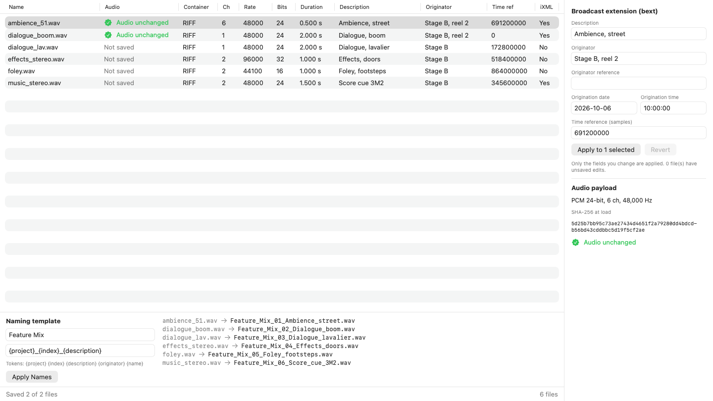
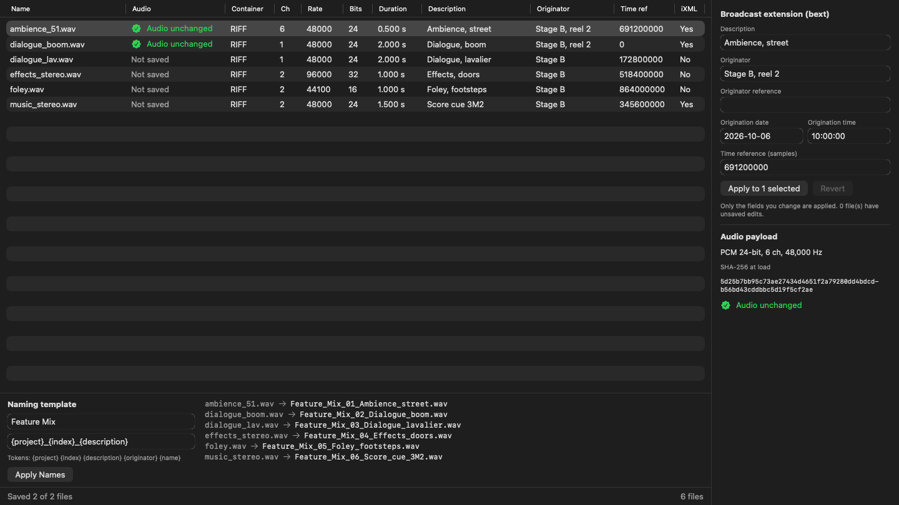

# StemKit

Swift code for finished audio stems on macOS, in three parts:

- **WaveContainer**: reads and writes RIFF/WAVE, RF64 and BW64 files, including the bext (EBU Tech 3285 v2) and iXML chunks, without loading the audio into memory and without changing it. By default every write hashes the audio payload before and after and fails if the hashes differ. Foundation only.
- **MelFrontEnd**: the log-mel spectrogram front end of `WhisperFeatureExtractor` (80 bins, 16 kHz, n_fft 400, hop 160), reproduced in Swift with Accelerate and checked element by element against fixtures from the Python reference.
- **Stem Inspector**: a sandboxed SwiftUI app that loads files or folders, shows their format and metadata in a table, edits bext fields, renames files from a template, and shows a per-file badge proving the audio did not change.

A `stemkit` command line tool exposes the container library: `inspect <file> --json`, `set <file> <field> <value>`, `verify <a> <b>`.

## Results measured on CI

From CI run 37400549002 on main, the run of the last change to code and tests ([log lines and link in docs/TESTING.md](docs/TESTING.md)). Runner: GitHub-hosted `macos-latest` (macOS 26.6.2, Xcode 26.6, Swift 6.3.3).

| What | Result |
|---|---|
| bext and iXML parity with the Python reference, 15 corpus files | 420 of 420 fields identical (15 files, 28 fields each); every WAV matches the SHA-256 recorded by the Python export |
| Log-mel parity with transformers 5.18.0 (numpy path), 6 clips of 80 x 3000 values | All 6 clips identical: maximum and mean absolute error 0.0, 240,000 of 240,000 values exact in each clip |
| DFT of length 400 against a naive O(N^2) DFT | Maximum absolute difference 1.42e-14 |
| Fuzzing: truncations and bit flips of valid headers | 8,028 in-memory cases: 2,174 valid parses, 5,854 typed errors, 0 other outcomes; on disk 196 writes with the audio hash unchanged, 44 typed errors, 0 other outcomes |
| RF64 and BW64 with a data chunk of 4 GiB plus 2 KiB, sparse | Files of 4,294,970,158 bytes using 20,480 bytes on disk; parsed, edited in place, audio hash unchanged |
| Command line smoke test (inspect, set, verify) | Passed: the edit went in place, only `bext.description` changed, the data hash was unchanged, `verify` told same and different audio apart |
| App: build, sandbox and hardened runtime check, unit tests | Release build signed ad hoc with flags `adhoc,runtime`; embedded entitlements exactly App Sandbox and user-selected read-write; 14 unit tests passed |
| Package tests | 49 tests in 14 suites passed |
| Mel benchmark on the runner (reported, not gated) | 215,085 mel frames per second (71.70 thirty-second chunks per second) in this run; across the fourteen runs that printed it, 105,720 to 268,006, depending on the runner |

## Screenshots

Rendered by a test on the CI runner from real files loaded through the real file worker; two files were edited and saved, so their badges are real. These are the exact artifact files of run 37400549002 (SHA-256 in [docs/TESTING.md](docs/TESTING.md)). The view is rendered in a borderless window, so the window's toolbar is not in the image.





## Layout

```
Package.swift                 Swift 6 package, macOS 14
Sources/WaveContainer/        container parsing, bext, iXML, writes, SHA-256 integrity check
Sources/MelFrontEnd/          direct DFT and the Whisper log-mel front end
Sources/StemInspectorCore/    view model, file worker actor, naming template (no SwiftUI)
Sources/StemInspectorUI/      SwiftUI views
Sources/StemKitCLI/           the stemkit command line tool
Tests/                        Swift Testing suites and their fixtures
App/                          Xcode project: app target, entitlements, app unit tests
reference/                    Python scripts that produce the reference fixtures
docs/                         decisions, sources, testing, release, limits
```

## How to run

On a Mac with Xcode 26:

```sh
swift test -c release -Xswiftc -enable-testing     # package tests (release: the 4 GiB tests hash a lot)
swift run stemkit inspect path/to/file.wav --json
swift run stemkit set path/to/file.wav bext.description "Dialogue, boom"
swift run stemkit verify a.wav b.wav                # exit 0: same audio, 1: different
xcodebuild test -project App/StemInspector.xcodeproj -scheme StemInspector -destination 'platform=macOS'
open App/StemInspector.xcodeproj                    # run the app from Xcode
```

The repository guard's name test reads its list from the `STEMKIT_DENIED_NAMES` environment variable, which CI fills from a repository secret, and fails when the variable is empty. For a local run, set it to the list, read from a file rather than typed on the command line (so it stays out of the shell history), or, to skip the check, to a made-up word that appears nowhere in the repository.

To regenerate the fixtures: `reference/export_metadata_golden.py` (needs the reference module, see [docs/SOURCES.md](docs/SOURCES.md)) and `reference/make_mel_fixtures.py` in a virtual environment built from `reference/requirements.txt` without torch.

## Documents

- [docs/DECISIONS.md](docs/DECISIONS.md): what was decided and why, the CI run history and the review rounds.
- [docs/SOURCES.md](docs/SOURCES.md): one row per technical claim, with the official source.
- [docs/TESTING.md](docs/TESTING.md): every test and the numbers from the CI run of the last code change.
- [docs/RELEASE.md](docs/RELEASE.md): signing and notarisation steps (not done here).
- [docs/LIMITS.md](docs/LIMITS.md): what is not done, and why.

## Method

Implementation was agent assisted. Design decisions, scope and review were human directed. Every technical claim was checked against official documentation or the official source code and is listed in [docs/SOURCES.md](docs/SOURCES.md) with its link (one row covers the private reference module, which has none); every result in this README comes from a CI log. Independent reviewers with no shared context read the code and the documents in rounds; every finding was checked against the code, and the rounds, their findings and what was done about them are recorded in [docs/DECISIONS.md](docs/DECISIONS.md).

## License

Copyright (c) 2026 StemKit contributors. All rights reserved. Shared for evaluation only. See [LICENSE](LICENSE).
